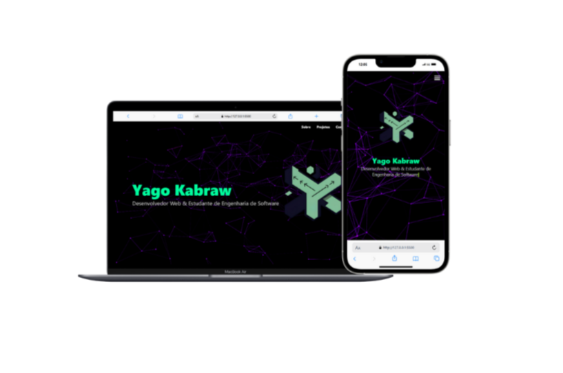

# 💼 Site Portfólio Pessoal - Yago Cabral

Este repositório contém um projeto de site pessoal desenvolvido com HTML e CSS, com o objetivo de apresentar informações profissionais, habilidades e contato do desenvolvedor Yago Cabral. O site é estático e foi publicado via **GitHub Pages**.

---

## 📸 Captura de Tela



---

## 🔗 Acesse o Site

📍 Veja o site online em:  
👉 **[https://seu-usuario.github.io/nome-do-repositorio/](https://yagorodrigues-bit.github.io/Portif-lio-Yago-Kbraw/)**  
> Substitua pelo link real após publicar no GitHub Pages

---

## 📁 Estrutura de Arquivos

```bash
.
├── index.html             # Página principal do site
├── style.css              # Estilos personalizados
├── fundo.png              # Imagem de fundo usada no layout
├── logo.png               # Logotipo exibido na interface
├── yago.jpeg              # Foto do desenvolvedor
├── ste_portifolio.png     # Imagem de preview do site (usada neste README)
├── EPcontabilidade.png    # Elemento gráfico adicional (possivelmente usado no site)
├── Currículo-Lattes.pdf   # Currículo profissional em PDF
└── README.md              # Documentação do projeto
🧪 Tecnologias Utilizadas
HTML5 – marcação da estrutura do site

CSS3 – estilização visual

Git e GitHub – versionamento e hospedagem

GitHub Pages – publicação da aplicação

🛠️ Como Executar Localmente
Clone o repositório:

bash
Copiar
Editar
git clone https://github.com/seu-usuario/nome-do-repositorio.git
Abra a pasta do projeto:

bash
Copiar
Editar
cd nome-do-repositorio
Clique duas vezes em index.html ou abra com seu navegador.

🚀 Como Publicar com GitHub Pages
Suba todos os arquivos para a branch main do repositório.

Vá em Settings > Pages.

Em “Source”, selecione a branch main e pasta /root.

Clique em Save.

Acesse a URL gerada pelo GitHub Pages.

👤 Sobre o Autor
Yago Cabral
📍 Estudante de Engenharia de Software
📧 Contato disponível no site

📄 Licença
Este projeto está licenciado sob os termos da licença MIT.
Sinta-se livre para usar, modificar e distribuir com atribuição.

yaml
Copiar
Editar

---

Se quiser, posso gerar esse `README.md` já com **seu nome de usuário do GitHub** e o **link verdadeiro do GitHub Pages**. Quer que eu faça isso agora?


